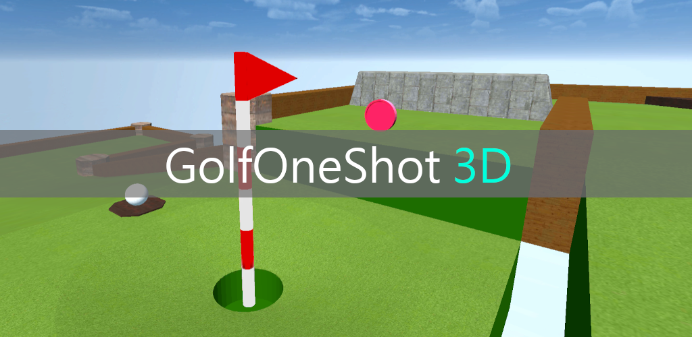
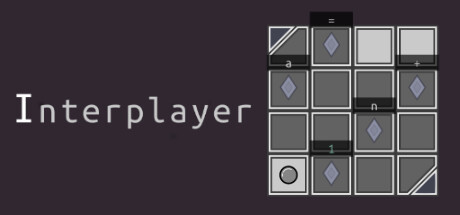

# Introduction
町田射空と申します。情報学を専攻しております。
I am a master’s student at the University of Tsukuba, working on Computer Graphics, Computer Vision, and deep learning-based image generation.
I have experience in Unity game development, Steam/Android release, and implementing a custom programming language interpreter in C.

# Affiliations
- 筑波大学大学院 理工情報生命学術院 システム情報工学研究群 情報理工学位プログラム 修士1年 (2026/4~現在)
- [CGG Lab](https://www.cgg.cs.tsukuba.ac.jp/index.html) (2025/4~現在)

# Education
- 苫小牧工業高等専門学校 (2019/4~2024/3)
- 筑波大学 情報学群 情報メディア創成学類 (2024/4~2026/3)
- 筑波大学大学院 理工情報生命学術院 システム情報工学研究群 情報理工学位プログラム (2026/4~現在)

# Achievements
- Unityユースクリエイターカップ2021
    - [シルバーアワード]((https://prtimes.jp/main/html/rd/p/000000204.000016287.html)) (144作品中上位12作品)
- U-22プログラミングコンテスト2022
    - [経済産業大臣賞](https://u22procon.com/2022/report/) (340作品中上位4作品)
    - SOMPO賞
- 第201回情報処理学会コンピュータグラフィックスとビジュアル情報学研究会 (CGVI)
    - [学生発表賞](https://cgvi.jp/info/student-award/)
- [筑波大学情報学群長表彰](https://inf.tsukuba.ac.jp/award/) (2026年卒業)

# Research & Projects
## [ゴルフワンショット3D](https://game.creators-guild.com/gck2021/1963/)
- Google Playにリリースしていましたが、現在は削除されています
- Keywords: Unity, C#, Android, Game Development

## [tolerance](https://github.com/machida3778/tolerance-language)
- 自作プログラミング言語
- 言語処理系はCで開発
- パラダイム: オブジェクト指向、スタック指向
- [Interplayer](https://store.steampowered.com/app/2209470/Interplayer/)のゲーム内で記述する言語として開発

## [Interplayer](https://store.steampowered.com/app/2209470/Interplayer/)
- Python-likeな自作言語toleranceの処理系を組み込んだパズルゲーム
- Steamにリリースし、現在公開中です。
- Keywords: Unity, C#, Programming Language, Game Development

## 全身人物画像の年齢編集
- 国際学会に投稿中で、論文は現在非公開です。
- Keywords: Computer Vision, Computer Graphics, Diffusion Models, Human Image Editing, 3D Human Modeling

# Research Interests
- Computer Graphics
- Computer Vision
- Deep Learning
- Diffusion Models
- Image Processing
- Image Editing
- Age Editing
- 3D Reconstruction

# Skills
- Python, C, C#, TypeScript
- PyTorch, Diffusers
- Unity
- Node.js, React
- Docker, Git, Linux

# Internship
- ラテラル・シンキング株式会社 (2022/8)

# Teaching Assistant
- GC12701 プログラミング
- GC54904 アドバンストCG

# Links
- Email: s2620668 [at] u.tsukuba.ac.jp
- [note](https://note.com/hna_machida)